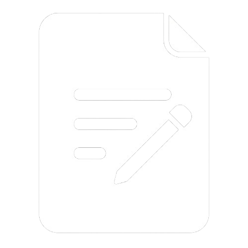

<p align="center">
  <picture>
    <source media="(prefers-color-scheme: dark)" srcset="src/assets/newlogo.png">
    
  </picture>
</p>

# Universal Metadata

<p align="center">A desktop application for reading and editing file metadata entirely on your machine, without any upload or cloud dependency.</p>

## Description

Universal Metadata provides a clean, intuitive interface for inspecting and editing the embedded metadata of any file directly on your local machine. Powered by Electron and ExifTool, it reads all available tags from a file, lets you edit them freely, and saves a timestamped copy with the updated metadata — the original file is **never modified**.

### Key Features

*   **Non-destructive Editing:** The original file is always preserved. Saves are written to a separate timestamped copy.
*   **Universal Format Support:** Reads metadata from images, videos, audio files, documents, and more — any format ExifTool supports.
*   **Full Tag Inspection:** Displays every readable metadata tag as a flat key/value table.
*   **Inline Editing:** Edit any writable tag directly in the table, with per-field reset and clear-all options.
*   **Custom Output Folder:** Choose any destination directory for your saved copies.
*   **Drag & Drop:** Simply drop files onto the interface to load them instantly.
*   **Batch Loading:** Load and manage multiple files at once from a file list panel.
*   **Dark / Light Theme:** Toggle between themes to match your preference.
*   **Cross-Platform Ready:** Built using Electron for desktop compatibility.
*   **Modern Interface:** Built with React and Tailwind CSS for a responsive user experience.

## Prerequisites

Ensure you have the following installed:

*   **Node.js** (version 18 or higher)
*   **npm** (usually bundled with Node.js)

## Getting Started

### Installation

1.  Clone the repository:
    ```bash
    git clone https://github.com/batuhan-bascivan/universal-metadata.git
    ```
2.  Navigate to the project directory:
    ```bash
    cd universal-metadata
    ```
3.  Install dependencies:
    ```bash
    npm install
    ```

### Development

To start the application in development mode:

```bash
npm run electron:dev
```

This starts the Vite dev server and launches the Electron window automatically.

### Production Build

To build the application for Windows:

```bash
npm run electron:build
```

Generates an NSIS installer and a portable `.exe` in the `release/` folder.

## How It Works

1.  **Drop** one or more files onto the drag-and-drop area.
2.  **Select** a file from the left panel to inspect its metadata.
3.  **Edit** any writable tag directly in the metadata table.
4.  **Choose** a destination folder via the folder icon (top-right).
5.  **Save** — a timestamped copy of the file is created with your changes applied.

> The original file is never touched. All writes go to a new copy named `<filename>_metadata_<timestamp>.<ext>`.

## Technical Stack

*   **Electron** — Framework for cross-platform desktop applications.
*   **React** — UI library for building the user interface.
*   **TypeScript** — Strongly typed programming language.
*   **Vite** — Fast build tool and dev server.
*   **Tailwind CSS** — Utility-first CSS framework.
*   **Shadcn/ui** — Component library for UI elements.
*   **ExifTool (exiftool-vendored)** — Industry-standard metadata reader/writer, bundled as a native binary.
*   **Radix UI** — Accessible primitives for dialogs, tooltips, scroll areas, and more.
*   **Lucide React** — Icon set used throughout the interface.
